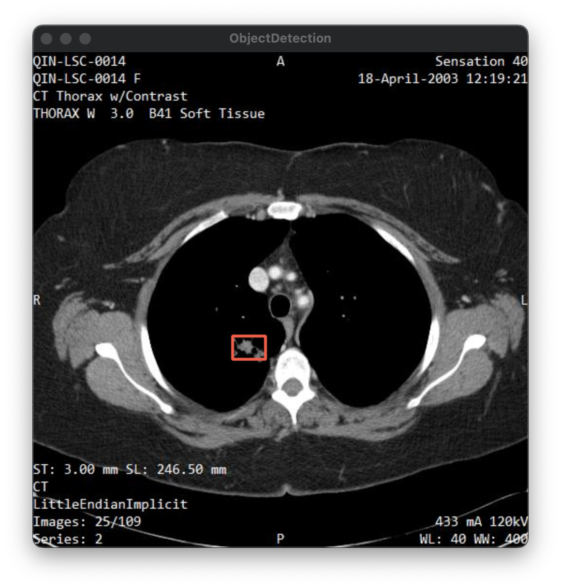

# The Application of YOLOv3 for Enhanced Non-Small Cell Lung Cancer Detection


## Project Overview

This project explores the application of the YOLOv3 (You Only Look Once version 3) algorithm to enhance the detection of Non-Small Cell Lung Cancer (NSCLC) in computed tomography (CT) imaging. The goal is to improve the accuracy and efficiency of NSCLC diagnosis by reducing human error in interpreting CT scans and potentially leading to more accurate diagnosis and treatment.

## Methods

The methodology employed in this project includes data acquisition and preprocessing, manual annotation and labeling of images, and model training using YOLOv3. The CT scan images used in this project were sourced from the [National Institutes of Health's Imaging Data Commons (IDC)](https://wiki.cancerimagingarchive.net/display/Public/QIN+LUNG+CT). The model training was conducted on Google Colab, which provides access to high-performance GPU resources. 

### Prepare Training Data and Weight
The CT scans were downloaded from the National Institutes of Health's Imaging Data Commons (IDC). The images were manually annotated and labeled using labelImg.py. The dataset was prepared, and the model was trained using [prepare_data.py](https://teaching.csap.snu.ac.kr/rna2118/ai_radiology_project/-/blob/main/prepare_data.py).

## Usage

To run this project, you'll need to follow these steps:

### Set Up Environment

1. Configure the [Gretchen environment](https://teaching.csap.snu.ac.kr/first-steps-in-programming-a-humanoid-ai-robot/isp-2023/course-materials/-/blob/main/resources/H02.Software.Installation.md).

2. Install this project.
```
git clone https://teaching.csap.snu.ac.kr/rna2118/ai_radiology_project.git
cd ai_radiology_project
```

3. Install trained weight.
```
rm ./custom_config/custom.weights
wget --load-cookies ~/cookies.txt "https://docs.google.com/uc?export=download&confirm=$(wget --quiet --save-cookies ~/cookies.txt --keep-session-cookies --no-check-certificate 'https://docs.google.com/uc?export=download&id=1pTpGIZboNjGUFyk-HYD1HogpL36hJmwn' -O- | sed -rn 's/.*confirm=([0-9A-Za-z_]+).*/\1\n/p')&id=1pTpGIZboNjGUFyk-HYD1HogpL36hJmwn" -O ./custom_config/custom.weights && rm -rf ~/cookies.txt
```

### Run Single image detector
```
python3 image_detector.py -i {IMAGE_PATH}
```

### Run Live detector

```
python3 live_detector.py
```
## Example Result


## References
- https://teaching.csap.snu.ac.kr/first-steps-in-programming-a-humanoid-ai-robot/isp-2023/course-materials

- Redmon, J., Divvala, S., Girshick, R., &amp; Farhadi, A. (2016, May 9). You Only Look Once: Unified, Real-Time Object Detection. [1506.02640] You Only Look Once: Unified, Real-Time Object Detection. https://arxiv.org/abs/1506.02640 

## Author
Robyn An
